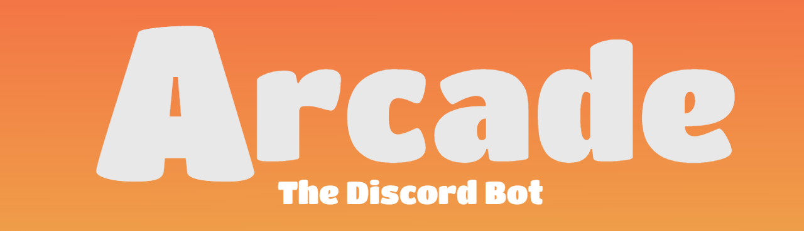

___

<h2>
<a href="#Introduction">Introduction</a>
・
<a href="#Installation and Use">Installation and Use</a>
・
<a href="#FAQs">FAQS</a>
</h3>

### Introduction

Arcade is a fun, minimal bot for your **[Discord](https://discord.com/)** server. It includes games, such as Tic-Tac-Toe, and a few ease-of-access commands. 

### Installation and Use

At the moment, Arcade is in a development stage meaning it will not be online 24/7. You can run the bot though:

- Register a Discord Bot on the Discord API website ([tutorial](https://github.com/SinisterRectus/Discordia/wiki/Setting-up-a-Discord-application))

- Install [Discordia](https://github.com/SinisterRectus/Discordia) if you don't already have it installed: https://github.com/SinisterRectus/Discordia/wiki/Installing-Discordia

- Clone this repo using `git clone https://github.com/Exquizzit/arcade.git`

- `cd` into the directory of the repo and run `luvit src\main` to run the bot

### FAQs

What do you plan on adding in the future?

- I plan on making several other minigames and maybe a sort of plugins system so that you can make your own games too!

Why Discordia?

- I've tried [discord.js](https://discord.js.org/#/) but I've always preferred Lua over JavaScript. So choosing Discordia was the obvious choice.

Can I contribute?

- Of course! Pull requests are open and any help is appreciated.